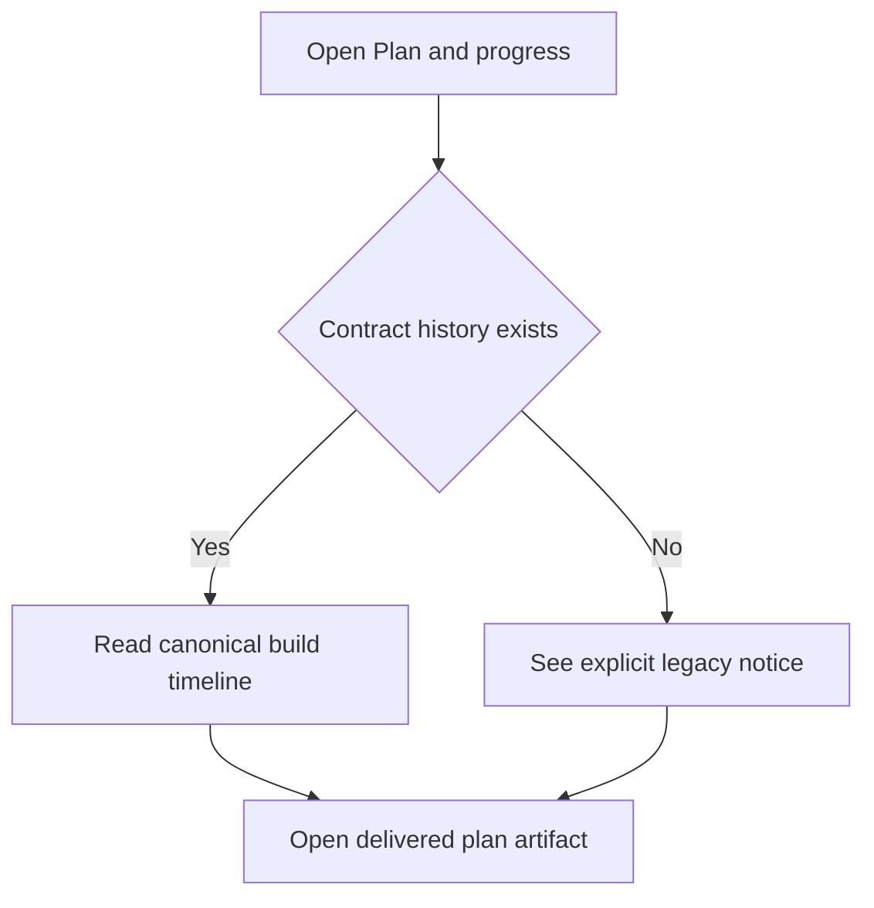
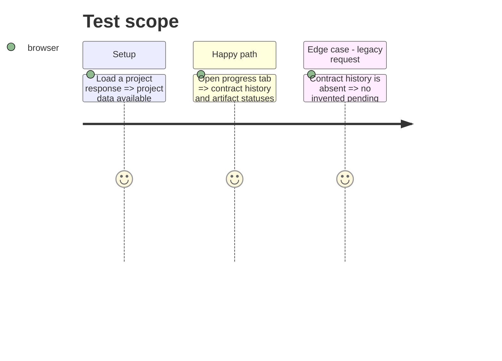

# Instruction: Backend-aligned project progress

## Architecture projection

> Tree of the final files. ✅ create · ✏️ modify · ❌ delete

```txt
modules/wp-builder/frontend/src/
└── components/
    └── PipelineView.jsx ✏️ replace obsolete phase inference with contract history and artifact delivery
```

## User Journey



## Test Scope



## Wireframe

```txt
┌────────────────────────────────────────────────────────┐
│ (1) Current lifecycle status                           │
├──────────────────────────┬─────────────────────────────┤
│ (2) Build history        │ (3) Plan deliverables       │
│     event timeline       │     artifact status cards   │
└──────────────────────────┴─────────────────────────────┘
```

1. Current lifecycle status: canonical backend state and concise explanation.
2. Build history: dated `contract.state_history` entries or an honest legacy notice.
3. Plan deliverables: latest artifact version and status, linked to its detail.

## Tasks to do

### `1)` Render canonical build progress

> Replace hard-coded inferred phases with real backend lifecycle events.

1. Read `contract.build_state` and `contract.state_history`.
2. Label backend states in user-facing French.
3. Provide a legacy fallback without fabricated progress.

### `2)` Render plan deliverables

> Show the latest real artifact status for each planning deliverable.

1. Load artifacts through the existing endpoint.
2. Aggregate the latest version by type.
3. Link available deliverables to the artifact view and surface request errors.

## Test acceptance criteria

| Task | Acceptance criteria |
| --- | --- |
| 1 | Modern projects show their persisted state history; legacy projects never show eight false pending phases. |
| 2 | Available artifacts show their version and backend status and can be opened. |
