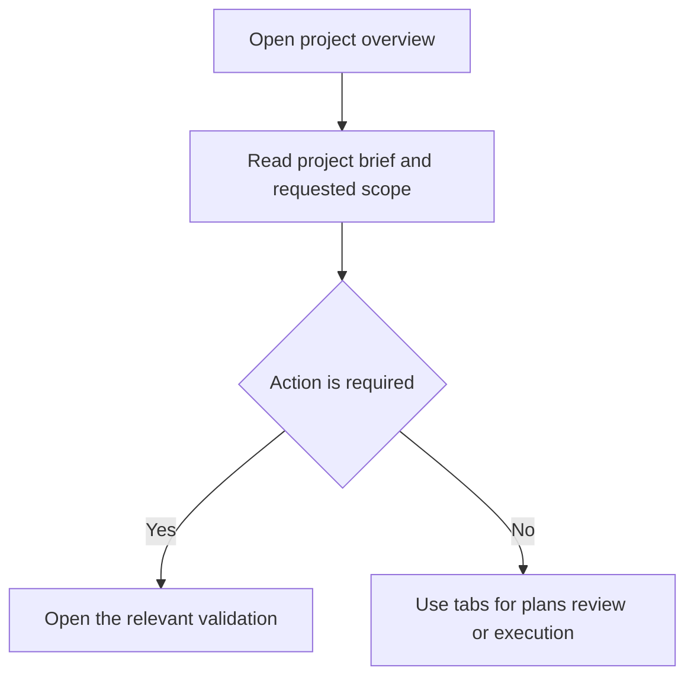
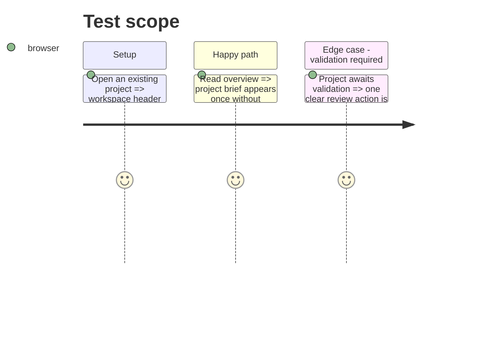

# Instruction: Concise project overview

## Architecture projection

> Tree of the final files. ✅ create · ✏️ modify · ❌ delete

```txt
modules/wp-builder/frontend/src/
├── App.jsx ✏️ remove obsolete detail-view callbacks
└── components/
    └── RequestDetail.jsx ✏️ reorganize content under the shared project workspace
```

## User Journey



## Test Scope



## Wireframe

```txt
┌────────────────────────────────────────────────────────┐
│ Shared workspace header and tabs                       │
├────────────────────────────────────────────────────────┤
│ (1) Project brief                                      │
│     objective · audience · pages · features            │
├────────────────────────────────────────────────────────┤
│ (2) Contextual status/action, only when useful         │
├────────────────────────────────────────────────────────┤
│ (3) Plan export tools, only for approved legacy plans  │
└────────────────────────────────────────────────────────┘
```

1. Project brief: one readable source of project identity and scope.
2. Contextual status/action: no duplicate global status or tab shortcuts.
3. Plan export tools: preserve useful legacy exports without obsolete instructions.

## Tasks to do

### `1)` Remove workspace duplicates

> Let `ProjectWorkspace` own project title, status, navigation, progress, and back action.

1. Remove the nested back button and duplicate header.
2. Remove pipeline, artifact, execution, delete, and status duplicates.
3. Keep only content specific to the overview.

### `2)` Reorganize overview content

> Present the brief first and show contextual actions only when applicable.

1. Improve responsive layout and field labels.
2. Preserve validation and legacy export capabilities.
3. Remove misleading instructions that tell users to manually send plans to another AI.

## Test acceptance criteria

| Task | Acceptance criteria |
| --- | --- |
| 1 | The detail route contains one project header, one back action, one status badge, and one set of section navigation. |
| 2 | The overview keeps request information and necessary validation/export actions without obsolete next-step copy. |
