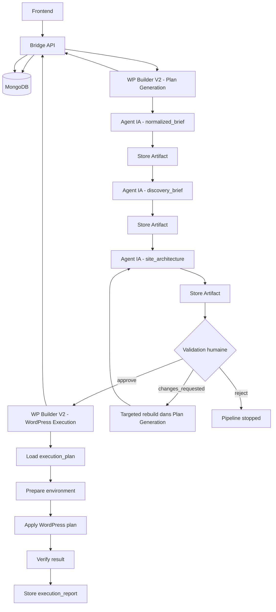
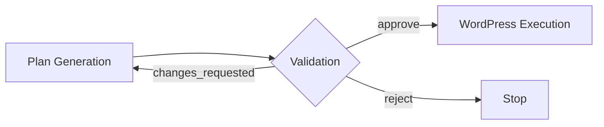

# n8n V2 Mermaid

## But

Donner une vue simple de l'organisation V2 avec :

- `WP Builder V2 — Plan Generation`
- `WP Builder V2 — WordPress Execution`
- le rôle du `bridge`
- l'emplacement des agents IA

## Vue simple

## Lecture simple

- `Plan Generation` contient les agents IA.
- Les agents IA appellent le bridge via `/task`.
- Chaque sortie utile est stockée comme artefact côté bridge.
- Après `site_architecture`, on passe en validation humaine.
- Si l'humain demande des changements, on régénère seulement la partie utile dans `Plan Generation`.
- Si l'humain approuve, on lance `WordPress Execution`.
- `WordPress Execution` n'est pas un workflow de réflexion IA principal. Il applique le plan validé.

## Où sont les agents IA ?

Les agents IA doivent être dans `WP Builder V2 - Plan Generation`.

Exemples de nœuds :

- `HTTP Request -> /task -> engine=codex -> normalized_brief`
- `HTTP Request -> /task -> engine=codex -> discovery_brief`
- `HTTP Request -> /task -> engine=codex -> site_architecture`
- `HTTP Request -> /task -> engine=codex -> content_plan`
- `HTTP Request -> /task -> engine=codex -> design_plan`
- `HTTP Request -> /task -> engine=codex -> wordpress_plan`
- `HTTP Request -> /task -> engine=codex -> execution_plan`

## Répartition recommandée

### Workflow 1 : `WP Builder V2 - Plan Generation`

Contient :

- webhook d'entrée
- lecture de la demande
- appels IA
- stockage des artefacts
- validation humaine
- régénération ciblée si nécessaire

### Workflow 2 : `WP Builder V2 - WordPress Execution`

Contient :

- lecture du plan validé
- exécution technique WordPress
- vérifications
- rapport final d'exécution

Ne contient pas en priorité :

- logique principale de génération métier
- boucle de validation humaine

## Version encore plus simple

