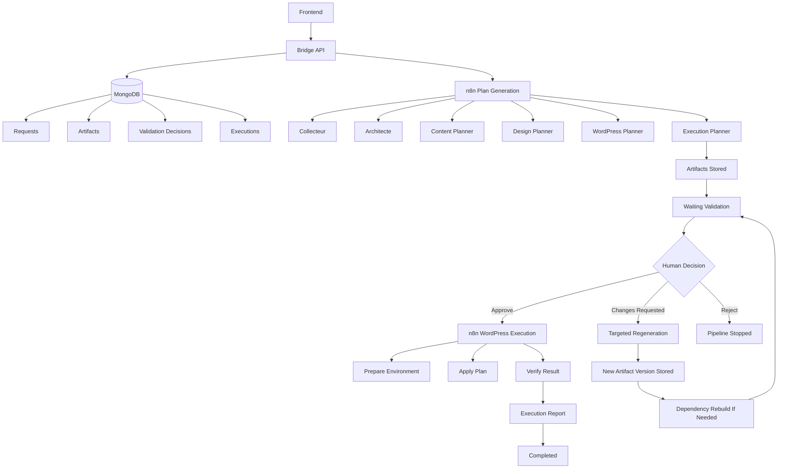

# WP Site Builder V2

## Objectif

Cette document décrit une évolution du pipeline `WP Site Builder` vers une architecture plus robuste.

Les objectifs sont :

1. formaliser un contrat JSON par étape
2. stocker les artefacts intermédiaires dans le bridge
3. remplacer le builder unique par plusieurs étapes spécialisées
4. ajouter un vrai statut de pipeline par phase
5. séparer la génération du plan et l'exécution WordPress

Cette V2 ne décrit pas seulement un nouveau workflow n8n. Elle décrit un modèle global entre :

- `n8n`
- le `bridge`
- le `frontend`
- les agents IA
- l'exécution technique WordPress

## Problèmes de la V1

La version actuelle fonctionne, mais elle reste fragile.

Principales limites :

- les étapes échangent des JSON implicites plutôt que des contrats stables
- les sorties des agents sont peu normalisées
- le bridge ne stocke pas proprement tous les artefacts intermédiaires
- le workflow mélange planification, validation, génération technique et callback final
- le builder final porte trop de responsabilités
- le statut global de la demande ne reflète pas vraiment la progression réelle
- la séparation entre décision IA et exécution WordPress n'est pas assez nette

## Principes de conception V2

La V2 repose sur 5 principes :

### 1. Contrats JSON stricts

Chaque étape produit un JSON validable, versionné et persistant.

### 2. Bridge comme source de vérité

Le bridge devient le stockage canonique de tous les artefacts métier.

### 3. Étapes spécialisées

Au lieu d'un seul builder terminal, plusieurs étapes techniques spécialisées produisent des sous-plans cohérents.

### 4. Pipeline observable

Chaque demande a un statut global et un statut détaillé par phase.

### 5. Séparation plan / exécution

La génération du plan WordPress ne doit pas être confondue avec son exécution réelle.

## Vue d'ensemble cible

Architecture logique visée :

### Diagramme Mermaid



```text
Frontend
   |
   v
Bridge API
   |
   +--> MongoDB / Requests / Artifacts / Validation Decisions / Executions
   |
   +--> n8n Plan Generation
   |        |
   |        +--> Agent: Collecteur
   |        +--> Agent: Architecte
   |        +--> Agent: Content Planner
   |        +--> Agent: Design Planner
   |        +--> Agent: WordPress Planner
   |        +--> Agent: Execution Planner
   |
   +--> Human Validation Loop
   |        |
   |        +--> Approve
   |        |        |
   |        |        +--> n8n WordPress Execution
   |        |
   |        +--> Changes Requested
   |                 |
   |                 +--> Targeted Regeneration
   |                          |
   |                          +--> New Artifact Version Stored
   |                          +--> Dependency Rebuild If Needed
   |                          +--> Waiting Validation
   |
   +--> n8n WordPress Execution
   |        |
   |        +--> Prepare Environment
   |        +--> Apply Plan
   |        +--> Verify Result
   |
   +--> Final Audit / Report
```

Le bridge ne sert plus seulement de callback final. Il devient le dépôt structuré du pipeline.

Vue dynamique du cycle cible :

```text
Request Created
   ->
Plan Generation
   ->
Artifacts Stored
   ->
Waiting Validation
   ->
Changes Requested
   ->
Targeted Regeneration
   ->
New Artifact Version Stored
   ->
Dependency Rebuild If Needed
   ->
Waiting Validation
   ->
Approved
   ->
WordPress Execution
   ->
Execution Audit
   ->
Completed
```

Cette vue rend explicites deux choses :

- la validation humaine n'est pas terminale et peut rouvrir une boucle de révision
- l'exécution WordPress est séparée de la génération du plan

Et plus précisément, après `Targeted Regeneration` :

- une nouvelle version d'artefact est stockée
- les artefacts dépendants peuvent être reconstruits
- le pipeline revient en `Waiting Validation`
- l'exécution WordPress ne commence jamais tant qu'une version n'a pas été explicitement approuvée

## Graphe de dépendances entre artefacts

Le champ `source_artifacts` ne doit pas être purement descriptif. Il doit permettre un recalcul automatique des artefacts dérivés.

Graphe cible recommandé :

```text
normalized_brief
   ->
discovery_brief
   ->
site_architecture
   ->
content_plan
   ->
wordpress_plan
   ->
execution_plan

site_architecture
   ->
design_plan
   ->
execution_plan

wordpress_plan
   ->
execution_plan
```

Chaque artefact doit donc stocker ses dépendances directes.

Exemple :

```json
{
  "artifact_type": "content_plan",
  "version": 3,
  "source_artifacts": [
    { "type": "site_architecture", "version": 4 },
    { "type": "discovery_brief", "version": 2 }
  ]
}
```

### Règle de reconstruction automatique

Quand un artefact est régénéré :

1. le bridge marque cet artefact comme nouvelle version active
2. le bridge recherche tous les artefacts qui dépendent de cette version précédente
3. ces artefacts passent au statut `stale`
4. n8n ou le bridge programme leur reconstruction selon le graphe de dépendance

Exemple concret :

- `site_architecture v2` est validée
- `content_plan v2` et `design_plan v2` en dépendent
- l'humain demande une révision
- le système produit `site_architecture v3`
- `content_plan v2`, `design_plan v2`, `wordpress_plan v2`, `execution_plan v2` deviennent `stale`
- le système reconstruit seulement les artefacts en aval nécessaires
- une nouvelle chaîne est créée :
  - `content_plan v3`
  - `design_plan v3`
  - `wordpress_plan v3`
  - `execution_plan v3`

### Algorithme recommandé

Pseudo-logique :

1. identifier l'artefact régénéré
2. parcourir le graphe de dépendances
3. marquer récursivement les descendants en `stale`
4. reconstruire dans l'ordre topologique
5. remettre le pipeline en validation

Cette logique peut être exécutée :

- soit dans le bridge
- soit via un workflow n8n dédié `Dependency Rebuild`

Le bridge reste néanmoins le bon endroit pour calculer les dépendances, car il possède l'état canonique des artefacts.

## Cycle de vie global

Le pipeline complet V2 est découpé en 2 macro-phases :

### Phase A : Génération du plan

Cette phase produit un plan validé, sans toucher au site WordPress réel.

Sous-étapes :

1. réception du brief
2. normalisation du brief
3. collecte et enrichissement
4. architecture du site
5. plan de contenu
6. plan design
7. plan technique WordPress
8. assemblage du plan global
9. validation humaine

### Phase B : Exécution WordPress

Cette phase applique le plan validé à un environnement WordPress.

Sous-étapes :

1. préparation environnement
2. création / mise à jour pages
3. configuration options WordPress
4. installation plugins et thème
5. injection contenus
6. post-actions
7. vérifications finales
8. rapport d'exécution

## Boucle de validation humaine et révision

Dans la V2, la validation humaine ne doit pas être limitée à un simple `oui/non`.

Le bon modèle est :

- `approved`
- `changes_requested`
- `rejected`

Quand l'humain demande des changements :

- le pipeline ne doit pas partir en exécution WordPress
- l'artefact visé doit rester traçable
- une nouvelle version doit être générée
- la demande doit revenir dans une boucle de validation

Cycle attendu :

```text
generated
   ->
waiting_validation
   ->
changes_requested
   ->
revising
   ->
waiting_validation
   ->
approved
   ->
execution
```

Le mode `rejected` correspond à un arrêt explicite du pipeline, sans reprise.

## Décision de validation

Une décision humaine doit être stockée comme un objet structuré.

Exemple :

```json
{
  "request_id": "uuid",
  "decision": "changes_requested",
  "target_artifact": "site_architecture",
  "target_version": 2,
  "comment": "La page Services manque de clarté et le ton est trop corporate.",
  "requested_changes": [
    "Rendre le ton plus premium",
    "Ajouter une section FAQ sur la page Contact",
    "Clarifier les bénéfices sur la page Services"
  ],
  "created_at": "date",
  "created_by": "user_id_or_email"
}
```

L'idée est de pouvoir relancer une phase précise à partir d'un retour humain exploitable, et pas seulement avec un commentaire libre perdu dans les logs.

## 1. Contrats JSON par étape

## Règles générales

Chaque étape doit :

- recevoir un JSON d'entrée connu
- produire un JSON de sortie versionné
- être validable par schéma
- être stockée dans le bridge
- ne pas dépendre implicitement du texte libre d'une étape précédente

Convention recommandée :

```json
{
  "contract_version": "1.0",
  "request_id": "uuid",
  "stage": "architecte",
  "payload": {}
}
```

Chaque artefact doit avoir :

- `contract_version`
- `request_id`
- `stage`
- `payload`
- `generated_at`
- `generator`

## Validation par JSON Schema

Les exemples JSON ne suffisent pas. La V2 doit fournir un JSON Schema formel par contrat.

Chaque contrat doit avoir :

- un identifiant de schéma
- une version
- une validation côté bridge
- idéalement une validation avant stockage et avant reprise de phase

Convention recommandée :

```text
schemas/
  normalized_brief.schema.json
  discovery_brief.schema.json
  site_architecture.schema.json
  content_plan.schema.json
  design_plan.schema.json
  wordpress_plan.schema.json
  execution_plan.schema.json
  execution_report.schema.json
```

Exemple de JSON Schema minimal pour `site_architecture` :

```json
{
  "$schema": "https://json-schema.org/draft/2020-12/schema",
  "$id": "site_architecture.schema.json",
  "type": "object",
  "required": ["contract_version", "request_id", "stage", "payload"],
  "properties": {
    "contract_version": { "type": "string" },
    "request_id": { "type": "string" },
    "stage": { "const": "site_architecture" },
    "payload": {
      "type": "object",
      "required": ["site_name", "site_type", "pages"],
      "properties": {
        "site_name": { "type": "string" },
        "site_type": { "type": "string" },
        "pages": {
          "type": "array",
          "items": {
            "type": "object",
            "required": ["slug", "title", "goal", "sections"],
            "properties": {
              "slug": { "type": "string" },
              "title": { "type": "string" },
              "goal": { "type": "string" },
              "sections": {
                "type": "array",
                "items": {
                  "type": "object",
                  "required": ["type", "title", "content_brief"],
                  "properties": {
                    "type": { "type": "string" },
                    "title": { "type": "string" },
                    "content_brief": { "type": "string" }
                  }
                }
              }
            }
          }
        }
      }
    }
  }
}
```

### Où valider

Validation recommandée à 3 niveaux :

1. juste après sortie agent IA
2. avant stockage dans Mongo
3. avant consommation par une étape aval

### Comportement en cas d'échec de schéma

Si un artefact échoue à la validation :

- il ne doit pas devenir version active
- il doit être stocké comme `invalid` ou `rejected`
- la phase doit passer en `failed`
- l'erreur de validation doit être stockée explicitement

## Contrat 1 : Brief normalisé

Nom proposé : `normalized_brief`

But :

- transformer le formulaire utilisateur en structure propre

Exemple :

```json
{
  "contract_version": "1.0",
  "request_id": "uuid",
  "stage": "normalized_brief",
  "payload": {
    "site_name": "super215",
    "site_type": "site vitrine",
    "business_domain": "voiture de luxe",
    "objective": "Présenter l'activité et générer des contacts",
    "pages_requested": ["Accueil", "À propos", "Services", "Contact"],
    "features_requested": ["Formulaire de contact", "SEO optimisé", "Responsive design"],
    "design_preferences": {
      "style": "moderne",
      "primary_color": "#3B82F6"
    }
  }
}
```

## Contrat 2 : Brief enrichi collecteur

Nom proposé : `discovery_brief`

But :

- identifier besoins, contraintes, ambiguïtés, objectifs, manques

Exemple :

```json
{
  "contract_version": "1.0",
  "request_id": "uuid",
  "stage": "discovery_brief",
  "payload": {
    "objectives": [],
    "constraints": {},
    "assumptions": [],
    "missing_information": [],
    "risk_flags": []
  }
}
```

## Contrat 3 : Architecture de site

Nom proposé : `site_architecture`

But :

- définir la structure du site

Exemple :

```json
{
  "contract_version": "1.0",
  "request_id": "uuid",
  "stage": "site_architecture",
  "payload": {
    "site_name": "string",
    "site_type": "string",
    "pages": [
      {
        "slug": "string",
        "title": "string",
        "goal": "string",
        "sections": [
          {
            "type": "string",
            "title": "string",
            "content_brief": "string"
          }
        ]
      }
    ],
    "design_direction": {
      "tone": "string",
      "colors": "string",
      "layout": "string"
    },
    "technical_notes": ["string"]
  }
}
```

## Contrat 4 : Plan de contenu

Nom proposé : `content_plan`

But :

- définir le contenu attendu par page et section

Exemple :

```json
{
  "contract_version": "1.0",
  "request_id": "uuid",
  "stage": "content_plan",
  "payload": {
    "pages": [
      {
        "slug": "accueil",
        "seo_title": "string",
        "meta_description": "string",
        "sections": [
          {
            "section_id": "hero",
            "copy_goal": "string",
            "content_blocks": []
          }
        ]
      }
    ]
  }
}
```

## Contrat 5 : Plan design

Nom proposé : `design_plan`

But :

- définir les choix UI sans encore les exécuter

Exemple :

```json
{
  "contract_version": "1.0",
  "request_id": "uuid",
  "stage": "design_plan",
  "payload": {
    "brand_direction": {
      "tone": "string",
      "palette": [],
      "type_scale": {},
      "layout_principles": []
    },
    "component_guidelines": []
  }
}
```

## Contrat 6 : Plan WordPress

Nom proposé : `wordpress_plan`

But :

- décrire ce qui devra être fait sur WordPress

Exemple :

```json
{
  "contract_version": "1.0",
  "request_id": "uuid",
  "stage": "wordpress_plan",
  "payload": {
    "pages_to_create": [],
    "menus_to_create": [],
    "plugins_to_install": [],
    "theme_strategy": {},
    "settings_to_apply": [],
    "forms_to_create": [],
    "seo_actions": []
  }
}
```

## Contrat 7 : Plan d'exécution

Nom proposé : `execution_plan`

But :

- assembler tout ce qui sera exécuté

Exemple :

```json
{
  "contract_version": "1.0",
  "request_id": "uuid",
  "stage": "execution_plan",
  "payload": {
    "validated": true,
    "execution_mode": "dry_run",
    "steps": [],
    "dependencies": [],
    "expected_outputs": []
  }
}
```

## 2. Stockage des artefacts intermédiaires dans le bridge

## Pourquoi

Aujourd'hui, le bridge stocke surtout :

- la demande initiale
- l'état global
- le résultat final

La V2 doit stocker chaque artefact intermédiaire pour :

- reprendre un pipeline
- auditer ce qui a été généré
- comparer les versions
- exposer la progression au frontend
- relancer une seule phase sans tout refaire

## Modèle cible

Deux approches possibles.

### Option A : artefacts embarqués dans `Request`

Ajouter un bloc :

```json
{
  "artifacts": {
    "normalized_brief": {},
    "discovery_brief": {},
    "site_architecture": {},
    "content_plan": {},
    "design_plan": {},
    "wordpress_plan": {},
    "execution_plan": {},
    "execution_report": {}
  }
}
```

Avantage :

- simple à implémenter

Limite :

- le document peut devenir gros

### Option B : collection dédiée `RequestArtifact`

Structure recommandée :

```json
{
  "requestId": "uuid",
  "artifact_type": "site_architecture",
  "version": 1,
  "status": "generated",
  "payload": {},
  "generator": {
    "engine": "codex",
    "stage": "architecte"
  },
  "created_at": "date"
}
```

Avantages :

- meilleur historique
- versionnage propre
- relance d'étapes plus simple

Cette option est préférable pour une vraie V2.

## Versionnement des artefacts

Chaque artefact doit être versionné.

Exemple :

- `site_architecture v1`
- `site_architecture v2`
- `site_architecture v3`

Quand un humain demande des changements :

- la version actuelle reste stockée
- une nouvelle version est générée
- la validation porte sur une version explicite

Cela permet :

- la comparaison entre versions
- l'audit des changements demandés
- la relance ciblée d'une phase
- la traçabilité des décisions humaines

## API bridge recommandée

Endpoints utiles :

- `GET /requests/:id/artifacts`
- `GET /requests/:id/artifacts/:type`
- `POST /requests/:id/artifacts`
- `POST /requests/:id/artifacts/:type/validate`
- `POST /requests/:id/artifacts/:type/regenerate`

## 3. Remplacer le builder unique par plusieurs étapes spécialisées

## Problème du builder unique

Le builder actuel fait trop de choses :

- interprète l'architecture
- décide des actions WordPress
- génère le script bash
- mélange le fond et l'exécution

Cela rend le système :

- difficile à déboguer
- difficile à valider
- difficile à faire évoluer

## Découpage recommandé

### Étape A : `Content Planner`

Produit :

- `content_plan`

Responsabilité :

- structurer le contenu page par page
- définir les sections et leurs objectifs

### Étape B : `Design Planner`

Produit :

- `design_plan`

Responsabilité :

- proposer la direction visuelle
- définir les contraintes d'interface

### Étape C : `WordPress Planner`

Produit :

- `wordpress_plan`

Responsabilité :

- transformer le plan métier en actions WordPress

### Étape D : `Execution Planner`

Produit :

- `execution_plan`

Responsabilité :

- ordonner les actions
- préparer l'exécution technique

### Étape E : `Script Generator`

Produit :

- `execution_script`

Responsabilité :

- générer un script bash ou un lot de commandes à partir du `execution_plan`

## Bénéfices

- meilleure lisibilité
- meilleure validation intermédiaire
- responsabilités claires
- possibilité de rejouer une seule étape
- meilleure qualité globale

## 4. Ajouter un vrai statut de pipeline par phase

## Problème actuel

Les statuts actuels sont trop larges :

- `pending`
- `processing`
- `waiting_validation`
- `completed`
- `failed`

Ils ne disent pas vraiment où la demande se trouve.

## Modèle cible

### Statut global

Conserver un statut global :

- `draft`
- `queued`
- `running`
- `waiting_validation`
- `approved`
- `executing`
- `completed`
- `failed`
- `cancelled`

### Statut détaillé par phase

Ajouter :

```json
{
  "pipeline": {
    "current_phase": "site_architecture",
    "phases": [
      {
        "name": "normalized_brief",
        "status": "completed"
      },
      {
        "name": "discovery_brief",
        "status": "completed"
      },
      {
        "name": "site_architecture",
        "status": "completed"
      },
      {
        "name": "content_plan",
        "status": "running"
      }
    ]
  }
}
```

Statuts par phase :

- `pending`
- `running`
- `completed`
- `waiting_validation`
- `changes_requested`
- `revising`
- `approved`
- `failed`
- `skipped`

## Usage frontend

Le frontend peut alors afficher :

- une timeline de pipeline
- la phase courante
- les artefacts disponibles
- les erreurs par phase
- les validations en attente
- les demandes de modification
- l'historique des versions

## Statut de validation recommandé

En plus du statut de phase, chaque artefact validable peut avoir :

```json
{
  "validation": {
    "status": "waiting_validation",
    "current_version": 2,
    "last_approved_version": 1,
    "last_decision": "changes_requested"
  }
}
```

Valeurs recommandées :

- `draft`
- `waiting_validation`
- `changes_requested`
- `approved`
- `rejected`

## 5. Séparer “génération du plan” et “exécution WordPress”

## Principe

La décision métier et l'application technique ne doivent pas être dans le même flux conceptuel.

Il faut distinguer :

- ce qu'on veut construire
- comment on va l'appliquer
- ce qui a effectivement été appliqué

## Phase A : planification

Entrée :

- brief client

Sortie :

- `execution_plan` validé

Cette phase est :

- réversible
- rejouable
- validable humainement
- sans impact sur WordPress

## Phase B : exécution

Entrée :

- `execution_plan` validé

Sortie :

- `execution_report`

Cette phase est :

- technique
- auditée
- potentiellement destructive
- distincte du raisonnement IA

## Pipeline recommandé

### Workflow n8n 1 : `Plan Generation`

Responsabilité :

- produire tous les artefacts de planification

Sortie :

- demande prête à validation

### Workflow n8n 2 : `Plan Approval`

Responsabilité :

- gérer la validation humaine
- figer un plan approuvé

### Workflow n8n 3 : `WordPress Execution`

Responsabilité :

- appliquer le plan validé sur WordPress

### Workflow n8n 4 : `Execution Audit`

Responsabilité :

- vérifier le résultat
- produire le rapport final

## Modèle de données recommandé

### `Request`

Contient :

- la demande utilisateur
- le statut global
- la phase courante
- les métadonnées principales

### `RequestArtifact`

Contient :

- tous les artefacts de pipeline

### `RequestExecution`

Contient :

- les tentatives d'exécution WordPress
- le mode `dry_run` ou `apply`
- les logs
- les résultats

## Frontend cible

Le frontend V2 devrait permettre :

- de créer une demande
- de voir l'avancement phase par phase
- d'ouvrir chaque artefact intermédiaire
- de comparer plusieurs versions d'un même artefact
- de valider un plan complet
- de demander des changements sur un artefact précis
- de lancer l'exécution WordPress séparément
- de consulter le rapport d'exécution

Écrans recommandés :

- `Demandes`
- `Pipeline`
- `Artefacts`
- `Validation`
- `Révisions`
- `Execution`
- `Audit`

## UX de révision recommandée

Quand une validation est demandée, l'utilisateur doit pouvoir :

- approuver
- demander des changements
- rejeter

Si l'utilisateur demande des changements, il doit pouvoir :

- cibler un artefact précis
- écrire un commentaire libre
- ajouter une liste de demandes structurées
- éventuellement choisir la phase à régénérer

Exemple d'actions frontend :

- `Approuver l'architecture`
- `Demander une révision`
- `Rejeter cette version`
- `Comparer v2 avec v1`

## API bridge recommandée pour la révision

Endpoints supplémentaires recommandés :

- `POST /requests/:id/validation-decisions`
- `GET /requests/:id/validation-decisions`
- `POST /requests/:id/artifacts/:type/:version/revise`
- `GET /requests/:id/artifacts/:type/versions`

Exemple :

- le frontend envoie une décision `changes_requested`
- le bridge enregistre cette décision
- n8n relance la phase ciblée
- un nouvel artefact est généré avec `version + 1`
- la demande revient en `waiting_validation`

## Exécution WordPress : stratégie

L'exécution WordPress ne devrait pas dépendre uniquement d'un script bash libre.

Stratégie recommandée :

### Option 1 : commandes structurées

Produire une liste d'actions normalisées :

```json
{
  "actions": [
    {
      "type": "create_page",
      "slug": "accueil",
      "title": "Accueil"
    },
    {
      "type": "install_plugin",
      "plugin": "wordpress-seo"
    }
  ]
}
```

Puis seulement ensuite générer :

- un script bash
- ou des commandes WP-CLI

### Option 2 : exécuteur applicatif

Créer un exécuteur côté bridge ou service dédié qui interprète `execution_plan`.

Avantage :

- moins de texte libre
- meilleure sécurité
- meilleure auditabilité

## Gouvernance des erreurs

La V2 doit distinguer :

- erreur IA de planification
- erreur de validation humaine
- demande explicite de révision humaine
- erreur technique WordPress
- erreur de callback
- erreur d'infrastructure

Chaque phase doit stocker :

- `error_type`
- `error_message`
- `error_details`
- `retry_count`
- `last_attempt_at`

## Stratégie de rollback et de reprise d'exécution

La V2 doit considérer l'exécution WordPress comme potentiellement partiellement réussie.

Il ne faut pas présumer qu'un script bash peut toujours être "rollbacké" proprement. Il faut distinguer :

- actions idempotentes
- actions compensables
- actions non compensables

### Classification recommandée des actions

Chaque étape d'exécution doit déclarer :

- `idempotent`
- `compensable`
- `compensation_action`

Exemple :

```json
{
  "step_id": "create_contact_page",
  "type": "create_page",
  "idempotent": true,
  "compensable": true,
  "compensation_action": {
    "type": "delete_page_if_created_by_execution"
  }
}
```

### Stratégie de reprise

Le modèle recommandé n'est pas uniquement `rollback`, mais `resume-safe`.

Deux stratégies possibles :

#### Option A : reprise idempotente

Chaque action est rejouable sans casser l'état existant.

Exemples :

- créer une page seulement si elle n'existe pas
- mettre à jour un menu par upsert
- installer un plugin seulement s'il n'est pas déjà présent

#### Option B : compensation partielle

Pour certaines actions, on peut enregistrer une action inverse.

Exemples :

- supprimer une page créée par l'exécution en échec
- restaurer une option WordPress précédente
- désactiver un plugin ajouté pendant l'exécution

### Modèle `RequestExecutionStep`

Il est recommandé de stocker les étapes exécutées individuellement.

Exemple :

```json
{
  "execution_id": "uuid",
  "step_id": "install_seo_plugin",
  "status": "completed",
  "started_at": "date",
  "completed_at": "date",
  "rollback_status": "not_needed",
  "rollback_data": {}
}
```

### Politique recommandée

- privilégier les actions idempotentes
- n'utiliser le rollback que pour les opérations réellement compensables
- permettre une reprise depuis la dernière étape cohérente
- produire un `execution_report` avec :
  - étapes complétées
  - étapes échouées
  - étapes compensées
  - prochaine action recommandée

### Si l'exécution échoue partiellement

Comportement recommandé :

1. marquer l'exécution `failed_partial`
2. enregistrer l'étape fautive
3. marquer les actions déjà appliquées
4. proposer soit :
   - `resume`
   - `compensate`
   - `manual_intervention_required`

Le frontend doit donc pouvoir afficher un état plus fin que `failed`.

## Logs, métriques et observabilité

La V2 doit inclure un socle d'observabilité dès le départ.

### Logs structurés

Chaque phase et chaque appel agent doit produire des logs structurés.

Champs minimum :

- `request_id`
- `execution_id`
- `artifact_type`
- `artifact_version`
- `phase`
- `event`
- `status`
- `duration_ms`
- `engine`
- `workflow_id`
- `n8n_execution_id`
- `error_type`

Exemple :

```json
{
  "request_id": "uuid",
  "phase": "site_architecture",
  "event": "artifact_generated",
  "artifact_type": "site_architecture",
  "artifact_version": 3,
  "duration_ms": 24873,
  "engine": "codex",
  "status": "success"
}
```

### Métriques recommandées

Le bridge doit pouvoir exposer au minimum :

- nombre de demandes créées
- nombre de demandes par statut
- durée moyenne par phase
- taux d'échec par phase
- nombre de révisions par artefact
- nombre de validations demandées
- nombre d'exécutions partielles en échec
- temps moyen entre `waiting_validation` et décision humaine
- temps moyen entre approbation et exécution complète

### Alerting recommandé

Alertes utiles :

- une phase échoue plus de `N` fois
- une demande reste bloquée trop longtemps en `waiting_validation`
- une exécution WordPress reste bloquée en `running`
- un taux d'échec anormal apparaît sur une phase donnée
- un schéma échoue régulièrement en validation

### Points d'instrumentation

L'observabilité doit exister :

- dans le bridge
- dans les workflows n8n
- dans les callbacks entre n8n et le bridge
- dans l'exécuteur WordPress

### Rapports d'audit

Chaque demande devrait pouvoir produire un résumé d'audit contenant :

- versions d'artefacts utilisées
- décisions humaines prises
- temps passé par phase
- exécution finale appliquée
- erreurs rencontrées
- état final

## Stratégie d'implémentation

## Étape 1

Formaliser les contrats JSON.

Livrables :

- schémas JSON
- version `contract_version`
- validation côté bridge

## Étape 2

Introduire le stockage d'artefacts dans le bridge.

Livrables :

- collection `RequestArtifact`
- endpoints de lecture

## Étape 3

Découper le builder.

Livrables :

- `content_plan`
- `design_plan`
- `wordpress_plan`
- `execution_plan`

## Étape 4

Introduire la timeline pipeline.

Livrables :

- statuts par phase
- UI de progression

## Étape 5

Séparer le workflow d'exécution WordPress.

Livrables :

- workflow de planification
- workflow d'approbation
- workflow d'exécution

## Recommandation finale

La bonne direction n'est pas d'ajouter plus de prompts dans le workflow actuel.

La bonne direction est :

- un pipeline orienté artefacts
- des contrats JSON stables
- un bridge qui devient la source de vérité
- une validation humaine sur un plan structuré
- une exécution WordPress découplée du raisonnement IA

## Résumé

La V2 doit transformer le système actuel en pipeline à états, avec :

- artefacts métier stockés
- contrats JSON par étape
- agents spécialisés
- statuts détaillés
- boucle de révision humaine versionnée
- séparation plan / exécution

Le résultat attendu est un système :

- plus lisible
- plus robuste
- plus testable
- plus observable
- plus facile à faire évoluer

## Plan de migration technique V1 -> V2

Cette section décrit une trajectoire d'implémentation concrète pour passer du système actuel à la V2.

### Étape 0 : stabiliser la V1

Avant de migrer :

- figer le workflow V1 actuel
- documenter les points d'entrée existants
- lister les champs réellement utilisés dans `Request`
- conserver la compatibilité avec `POST /requests`, `POST /requests/:id/approve` et `POST /requests/:id/callback`

Objectif :

- éviter de casser le flux fonctionnel pendant la migration

### Étape 1 : introduire les nouveaux modèles Mongo

La V2 doit ajouter des collections dédiées sans casser immédiatement `Request`.

#### Modèle 1 : `Request`

Le document `Request` reste l'ancre principale.

Évolution recommandée :

```json
{
  "requestId": "uuid",
  "status": "running",
  "current_phase": "site_architecture",
  "input": {},
  "pipeline": {
    "current_phase": "site_architecture",
    "phases": [
      { "name": "normalized_brief", "status": "completed" },
      { "name": "discovery_brief", "status": "completed" },
      { "name": "site_architecture", "status": "waiting_validation" }
    ]
  },
  "validation": {
    "status": "waiting_validation",
    "target_artifact": "site_architecture",
    "target_version": 2
  }
}
```

#### Modèle 2 : `RequestArtifact`

Nouveau modèle recommandé.

Exemple :

```json
{
  "requestId": "uuid",
  "artifact_type": "site_architecture",
  "version": 2,
  "status": "generated",
  "payload": {},
  "generator": {
    "engine": "codex",
    "stage": "architecte"
  },
  "created_at": "date"
}
```

Champs utiles :

- `requestId`
- `artifact_type`
- `version`
- `status`
- `payload`
- `generator`
- `source_artifacts`
- `created_at`

#### Modèle 3 : `ValidationDecision`

Nouveau modèle recommandé.

Exemple :

```json
{
  "requestId": "uuid",
  "artifact_type": "site_architecture",
  "artifact_version": 2,
  "decision": "changes_requested",
  "comment": "La page Services manque de clarté",
  "requested_changes": [
    "Ajouter une FAQ",
    "Rendre le ton plus premium"
  ],
  "created_by": "user@example.com",
  "created_at": "date"
}
```

#### Modèle 4 : `RequestExecution`

Ce modèle isole l'exécution WordPress.

Exemple :

```json
{
  "requestId": "uuid",
  "execution_id": "uuid",
  "mode": "dry_run",
  "status": "running",
  "plan_version": 3,
  "steps": [],
  "logs": [],
  "result": {},
  "created_at": "date"
}
```

### Étape 2 : ajouter les nouveaux endpoints bridge

Le bridge V2 doit exposer une API plus riche.

#### Endpoints à conserver

- `POST /requests`
- `GET /requests`
- `GET /requests/:id`
- `POST /requests/:id/approve`
- `POST /requests/:id/callback`

#### Endpoints à ajouter pour les artefacts

- `GET /requests/:id/artifacts`
- `GET /requests/:id/artifacts/:type`
- `GET /requests/:id/artifacts/:type/versions`
- `POST /requests/:id/artifacts`

#### Endpoints à ajouter pour la validation

- `POST /requests/:id/validation-decisions`
- `GET /requests/:id/validation-decisions`
- `POST /requests/:id/artifacts/:type/:version/revise`

#### Endpoints à ajouter pour l'exécution

- `POST /requests/:id/executions`
- `GET /requests/:id/executions`
- `GET /requests/:id/executions/:executionId`

#### Rôle des endpoints

`POST /requests/:id/validation-decisions`

- enregistre `approved`, `changes_requested` ou `rejected`

`POST /requests/:id/artifacts/:type/:version/revise`

- relance une phase ciblée à partir d'une décision humaine

`POST /requests/:id/executions`

- démarre l'exécution WordPress à partir d'un plan approuvé

### Étape 3 : découper n8n en workflows spécialisés

La V1 repose sur un seul workflow principal.

La V2 devrait séparer les responsabilités.

#### Workflow 1 : `Plan Generation`

Responsabilité :

- produire les artefacts métier

Étapes :

- `normalized_brief`
- `discovery_brief`
- `site_architecture`
- `content_plan`
- `design_plan`
- `wordpress_plan`
- `execution_plan`

#### Workflow 2 : `Validation Loop`

Responsabilité :

- attendre une validation
- recevoir une décision
- relancer la bonne phase si nécessaire

Entrées :

- `requestId`
- `artifact_type`
- `artifact_version`
- décision humaine

#### Workflow 3 : `WordPress Execution`

Responsabilité :

- appliquer le plan approuvé

Étapes possibles :

- préparation environnement
- création pages
- installation plugins
- configuration thème
- injection contenu
- réglages SEO
- vérifications

#### Workflow 4 : `Execution Audit`

Responsabilité :

- produire un rapport final exploitable

Sorties :

- statut final
- rapport d'exécution
- logs
- erreurs détaillées

### Étape 4 : migration progressive du backend bridge

Migration recommandée en 3 passes.

#### Passe A

Ajouter les nouveaux modèles Mongo sans supprimer l'ancien champ `result`.

But :

- compatibilité ascendante

#### Passe B

Faire écrire les nouveaux artefacts par les workflows V2 tout en continuant à remplir les champs V1 nécessaires au frontend existant.

But :

- introduire V2 sans casser la production

#### Passe C

Migrer le frontend vers la lecture des artefacts et des phases, puis déprécier progressivement la logique V1.

### Étape 5 : migration du frontend

Le frontend V2 doit évoluer par couches.

#### Vue 1 : demandes

Afficher :

- statut global
- phase courante
- dernière validation

#### Vue 2 : pipeline

Afficher :

- timeline des phases
- phase courante
- phase en erreur

#### Vue 3 : artefacts

Afficher :

- type d'artefact
- version
- contenu
- historique

#### Vue 4 : validation

Permettre :

- approbation
- demande de changements
- rejet
- comparaison entre versions

#### Vue 5 : exécution

Afficher :

- statut d'exécution WordPress
- logs
- rapport final

### Étape 6 : stratégie de compatibilité

Pendant la migration :

- conserver l'ancien frontend fonctionnel
- conserver les endpoints V1
- faire coexister V1 et V2 pendant une période courte
- réserver un flag de bascule pour lancer les nouveaux workflows

Exemple de feature flag :

```env
WP_BUILDER_PIPELINE_VERSION=v2
```

### Étape 7 : ordre d'implémentation conseillé

Ordre recommandé :

1. créer `RequestArtifact`
2. créer `ValidationDecision`
3. ajouter le stockage d'artefacts dans le bridge
4. ajouter les endpoints de lecture d'artefacts
5. découper le workflow de planification
6. ajouter la boucle de validation
7. ajouter `RequestExecution`
8. séparer l'exécution WordPress
9. migrer le frontend

### Fichiers à créer ou modifier

Côté `bridge` :

- nouveau modèle `RequestArtifact`
- nouveau modèle `ValidationDecision`
- nouveau modèle `RequestExecution`
- extension de [Request.js](/home/cundo/Bureau/code_perso/MCP/MCP_N8N/bridge/src/db/models/Request.js)
- nouvelles routes sous `bridge/src/routes/`
- services de validation et de versionnement

Côté `frontend` :

- enrichissement de [App.jsx](/home/cundo/Bureau/code_perso/MCP/MCP_N8N/bridge/frontend/src/App.jsx)
- nouvelle vue pipeline
- nouvelle vue artefacts
- nouvelle vue révisions
- nouvelle vue exécution

Côté `n8n` :

- séparation du workflow V1 en plusieurs workflows
- contrats JSON stricts à chaque sortie d'agent
- callbacks intermédiaires vers le bridge

### Résultat attendu de la migration

À la fin de la migration, le système doit permettre :

- de suivre un pipeline par phases
- de stocker tous les artefacts produits
- de réviser une phase sans relancer tout le pipeline
- de versionner les sorties IA
- de distinguer clairement planification et exécution WordPress
- d'auditer le résultat final
